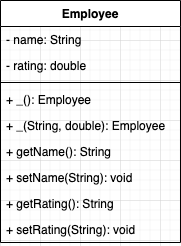
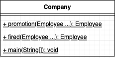
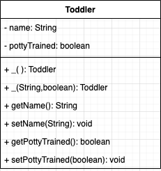
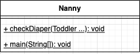
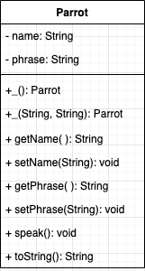

# Lab 03

The lecture today was on:

* Overloading Methods and Parameters

## Example and Activity 01


In the package `com.codedifferently.labs.lab03a.examples.example1_employees` there are two classes : 

* Employee <br>
* Company <br>


> In UML underlined items are 'STATIC'

### Step 01

Take a look at 'Employee' and 'Company' classes in the package, write all teh comments for the class. Make sure to mark all the constructors, variables, and getter / setter methods. Then review with classmates or class.

### Step 02

Use the UML below for 'Toddler' and 'Nanny' then complete classes in the 'com.codedifferently.labs.lab03a.activities.activity01' package

* **Toddler** <br> 
* **Nanny** <br> 

In the 'Nanny' class add the following code main method :

```
public static void main(String[] args) {
    Toddler hakim = new Toddler("Hakim", true);
    Toddler kimberly = new Toddler("Kimberly", false);
    Toddler richard = new Toddler("Richard", false);
    checkDiaper(hakim, kimberly, richard);
}
```

The output should be as follows:

```
Hakim needs to be taken to the bathroom
Kimberly needs to have their diaper changed
Richard needs to have their diaper changed
```

When the `checkDiaper` method is called in the `Nanny`, it will check the value of pottyTrained. 

If `pottyTrained` is equal to true it should print out the toddlers name, and `needs to be taken to the bathroom`. 

If `pottyTrained` is equal to false it should print out the toddlers name, and `needs to have their diaper changed`.

## Example and Activity 02

### Step 01

Take a look at 'Dog' and 'DogTester' classes in the package, write all teh comments for the class. Make sure to mark all the constructors, variables, and getter / setter methods. Then review with classmates or class.

### Step 02

Use the UML below for `Parrot` then complete class in the `com.codedifferently.labs.lab03a.activities.activity02` package.

* **Parrot** <br> 

This is the main method for ParrotTester

```
public static void main(String[] args) {
    Parrot parrot1 = new Parrot();
    System.out.println(parrot1);
    parrot1.speak();

    Parrot parrot2 = new Parrot("Frankie", "Wants a Coffee");
    System.out.println(parrot2);
    parrot2.speak();
}
```

The output should be:

```
Parrot{name='Polly', phrase='wants a Cracker'}
Polly wants a Cracker
Parrot{name='Frankie', phrase='Wants a Coffee'}
Frankie Wants a Coffee
```

When the `speak` method is called on the `Parrot` object, it should print the parrots name and its phrase.

The Parrots default name should be Polly, and its default Phrase should be `wants a Cracker`.